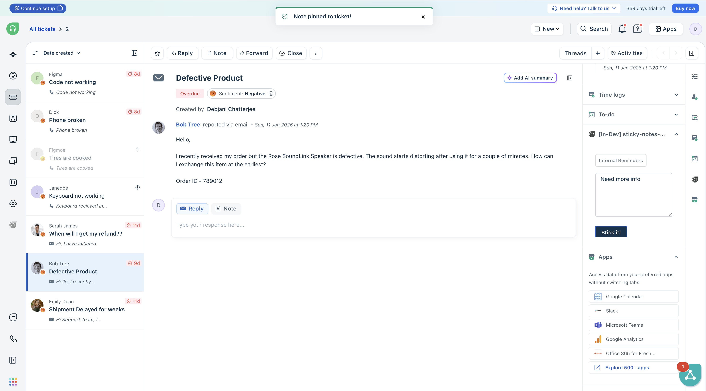
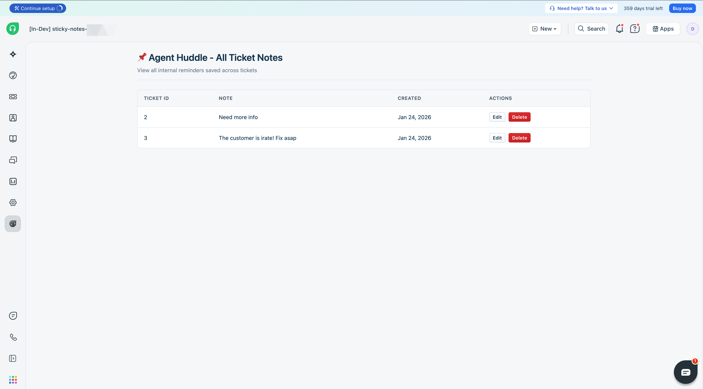

# Agent Huddle - Sticky Notes

A Freshworks Platform 3.0 sample app that provides a "Sticky Note" area in the ticket sidebar using **Entity Storage (Custom Objects)**.

## Description

Often, agents need to leave "private context" on a ticket that isn't a formal private note—like a temporary reminder or a "heads up" for the next shift. This app provides a "Sticky Note" area in the sidebar that saves data specifically to that ticket using the platform's own storage.

Currently, native private notes do not allow an agent to view all the ticket notes in a consolidated view to act upon it or take decisions based on the same. **Sticky-Notes** is an easy-to-use, and customizable app that lets agents view important ticket notes when agents change shifts.

### Core Functionality: Entity Storage (Custom Objects)

The heart of this app is **Entity Storage**, which allows for structured data persistence. Unlike simple key-value storage, Entity Storage enables:
- **Relational Data**: Notes are linked to specific `ticket_id`s.
- **Advanced Querying**: Efficiently fetching all notes or filtering by specific fields.
- **Structured Schemas**: Defined fields for `ticket_id` and `note_content`.

## User Interfaces

The app provides two distinct interfaces to interact with the stored notes:

1. **Ticket Sidebar** - A sticky note text area where agents can quickly jot down private context for the current ticket. Notes are automatically loaded when revisiting a ticket.


2. **Full Page App** - A dashboard displaying all saved notes across tickets with edit and delete capabilities.


## Platform 3.0 Features Used

### 1. Entity Storage (Custom Objects)

The app uses Entity Storage to persist notes across sessions. This demonstrates the full CRUD lifecycle:

| Operation | Method | Description |
|-----------|--------|-------------|
| **Create** | `entity.create()` | Creates a new note record |
| **Read** | `entity.getAll()` with query | Fetches notes filtered by ticket_id |
| **Update** | `entity.update(display_id, data)` | Updates existing note content |
| **Delete** | `entity.delete(display_id)` | Removes a note record |

**Entity Schema** (`config/entities.json`):
```json
{
  "ticket_notes": {
    "fields": [
      { "name": "ticket_id", "type": "text", "filterable": true, "required": true },
      { "name": "note_content", "type": "paragraph" }
    ]
  }
}
```

**Key Implementation:**
```javascript
// Initialize Entity Storage with versioned interface
const entity = client.db.entity({ version: "v1" });
const ticketNotes = entity.get("ticket_notes");

// Query with filterable field
const result = await ticketNotes.getAll({
  query: { ticket_id: ticketId }
});

```

### 2. Data Methods

Used to fetch current ticket context:

```javascript
const ticketData = await client.data.get('ticket');
const ticketId = String(ticketData.ticket.id);
```

### 3. Interface Methods (showNotify)

Triggers native toast notifications in the ticket sidebar:

```javascript
await client.interface.trigger("showNotify", {
  type: "success",
  message: "Note pinned to ticket!"
});
```

### 4. Events Methods

Listens for app activation to load data:

```javascript
client.events.on('app.activated', loadExistingNote);
```

### 5. Crayons UI Components

The app uses Freshworks Crayons v4 design system:

| Component | Usage |
|-----------|-------|
| `<fw-label>` | Section titles |
| `<fw-textarea>` | Note input field |
| `<fw-button>` | Action buttons (Save, Edit, Delete) |
| `<fw-modal>` | Edit and delete confirmation dialogs |
| `<fw-spinner>` | Loading state indicator |

## Project Structure

```
├── app/
│   ├── index.html          # Ticket sidebar UI
│   ├── full_page.html      # Full page app UI
│   ├── scripts/
│   │   ├── app.js          # Ticket sidebar logic
│   │   └── full_page.js    # Full page app logic
│   └── styles/
│       ├── style.css       # Sidebar styles
│       └── full_page.css   # Full page styles
├── config/
│   └── entities.json       # Entity Storage schema
└── manifest.json           # App configuration
```

## Prerequisites

- [Freshworks CLI (FDK)](https://developers.freshworks.com/docs/app-sdk/v3.0/support_ticket/basic-dev-tools/freshworks-cli//) v9.1.1 or later
- Node.js v18.x
- A Freshdesk or Freshservice trial account

## Local Development

1. Clone the repository:
   ```bash
   git clone <repo-url>
   cd sticky-notes
   ```

2. Run the app locally:
   ```bash
   fdk run
   ```

3. Open your Freshdesk/Freshservice account with `?dev=true`:
   ```
   https://your-domain.freshdesk.com/helpdesk/tickets/1?dev=true
   ```

## Testing Entity Storage

The FDK creates a local `.sqlite` file to simulate Entity Storage during development. To reset the data:

```bash
# Stop the server and delete the SQLite file
rm .fdk/store.sqlite
fdk run
```

## Key Learnings

1. **Entity Storage vs Key-Value Storage**: Entity Storage supports querying with filterable fields, pagination, and structured schemas - ideal for relational data.

2. **Versioned Interface**: Always use `client.db.entity({ version: "v1" })` to access Entity Storage.

3. **Crayons Events**: Crayons components emit custom events like `fwSubmit` instead of standard DOM events.

4. **App State Management**: Use an IIFE with a state object to avoid scope issues in async operations.

## Resources

- [Entity Storage Documentation](https://developers.freshworks.com/docs/app-sdk/v3.0/support_ticket/data-store/entity-storage/)
- [Crayons Components](https://crayons.freshworks.com/)
- [Interface Methods](https://developers.freshworks.com/docs/app-sdk/v3.0/support_ticket/front-end-apps/interface-methods/)
