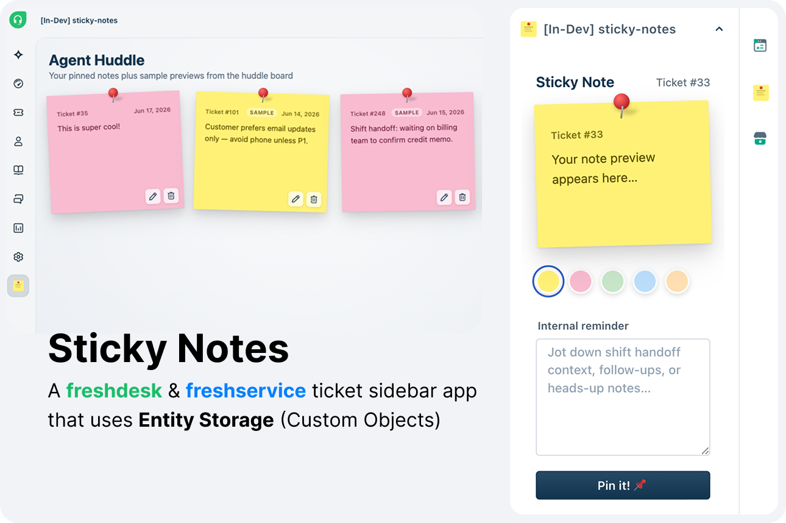

<p align="center">
  
</p>

# Agent Huddle — Sticky Notes

A Freshworks Platform 3.0 **React Meta** sample app that lets agents pin colored sticky notes to tickets using **Entity Storage**, with a full-page **Agent Huddle** board for viewing and managing notes across tickets.

## Description

Agents often need lightweight, ticket-scoped reminders — shift handoffs, VIP flags, or follow-up context that is not a formal private note. Sticky Notes provides a post-it style sidebar on each ticket and a consolidated full-page board so the team can see pinned context at a glance.

### Core Functionality

1. **Pin a note on a ticket** — pick a color, preview the card live, and save one sticky note per ticket in Entity Storage.
2. **Revisit and update** — reopening the ticket sidebar loads the saved note for that ticket automatically.
3. **Browse the huddle board** — the full-page app lists all pinned notes plus sample cards for demo; edit or delete with icon actions.

## User Interfaces

| Surface | Placement | Behavior |
| --- | --- | --- |
| `app/ticketSidebar.html` | `support_ticket.ticket_sidebar` | Color picker, live preview card, textarea, **Pin it!** / **Update note** |
| `app/index.html` | `common.full_page_app` | **Agent Huddle** grid of pinned notes with edit/delete icons |

### Ticket Sidebar

- Loads the sticky note saved for the **current ticket** (`client.data.get('ticket')`).
- Five color swatches: yellow, pink, green, blue, orange.
- Live preview card with pin and drop shadow.
- Creates a new note on first pin; subsequent saves update the same record.
- Toast feedback via `showNotify`; iframe height adjusted with `client.instance.resize()`.

### Full-Page Board

- Fetches all notes from Entity Storage with pagination support.
- Always shows **six sample sticky notes** (tagged **Sample**) for demo; saved notes appear first.
- Each card has **edit** and **delete** icon buttons (bottom-right).
- Edit opens a modal with color picker and textarea; delete confirms before removal.
- Sample notes can be edited or hidden in-session (changes reset on refresh).

## Platform 3.0 Features Used

### 1. Entity Storage (Custom Objects)

Notes are stored in the `ticket_notes` entity with filterable fields for efficient per-ticket queries.

| Operation | Method | Where used |
| --- | --- | --- |
| Create | `entity.create()` | Sidebar — first pin |
| Read | `entity.getAll({ query })` | Sidebar — load by `ticket_id`; board — fetch all |
| Update | `entity.update(display_id, data)` | Sidebar — update note; board — edit modal |
| Delete | `entity.delete(display_id)` | Board — delete modal |

**Entity schema** (`config/entities.json`):

```json
{
  "ticket_notes": {
    "fields": [
      { "name": "ticket_id", "type": "text", "filterable": true, "required": true },
      { "name": "note_content", "type": "paragraph" },
      { "name": "note_color", "type": "text", "filterable": true }
    ]
  }
}
```

**Query by ticket:**

```javascript
const entity = client.db.entity({ version: 'v1' });
const ticketNotes = entity.get('ticket_notes');

const result = await ticketNotes.getAll({
  query: { ticket_id: String(ticketId) }
});
```

### 2. Data Methods

```javascript
const ticketData = await client.data.get('ticket');
const ticketId = String(ticketData.ticket.id);
```

### 3. Interface Methods

```javascript
await client.interface.trigger('showNotify', {
  type: 'success',
  title: 'Sticky note',
  message: 'Sticky note pinned to this ticket!'
});
```

### 4. Instance Methods

```javascript
client.instance.resize({ height: '520px' });
```

### 5. React Meta + Crayons

Built with `metaConfig.framework: "react"`. UI uses Crayons React components:

| Component | Usage |
| --- | --- |
| `<FwTextarea>` | Note input in sidebar and edit modal |
| `<FwButton>` | Pin, update, refresh, modal actions |
| `<FwModal>` | Edit and delete confirmation on full-page board |
| `<FwSpinner>` | Loading states |
| `<FwIcon>` | Edit and delete icons on board cards |

## Project Structure

```
├── app/
│   ├── index.html                 # Full-page Agent Huddle board
│   ├── ticketSidebar.html         # Ticket sidebar surface
│   ├── public/icon.svg            # React Meta app icon (required path)
│   ├── components/
│   │   ├── index.jsx              # Full-page React entry
│   │   ├── FullPageApp.jsx        # Notes grid, modals, sample merge
│   │   ├── bootstrap/crayonsInit.js
│   │   ├── lib/
│   │   │   ├── noteColors.js      # Five color tokens
│   │   │   ├── notesService.js    # Entity Storage CRUD helpers
│   │   │   └── sampleNotes.js     # Demo cards for full-page board
│   │   ├── ui/
│   │   │   ├── StickyNoteCard.jsx # Pinned post-it card + pin
│   │   │   └── ColorPicker.jsx    # Sidebar color swatches
│   │   └── placeholders/
│   │       ├── ticketSidebar.jsx  # Sidebar React entry
│   │       ├── TicketSidebarApp.jsx
│   │       └── PlaceholderWrapper.jsx
│   └── styles/style.css
├── config/
│   └── entities.json              # Entity Storage schema
├── tests/
│   └── app.test.js                # Vitest — colors, notes service, samples
├── manifest.json                  # React Meta + full_page_app + ticket_sidebar
├── package.json
└── vitest.config.js
```

## Prerequisites

- [Freshworks CLI (FDK)](https://developers.freshworks.com/docs/app-sdk/v3.0/support_ticket/basic-dev-tools/freshworks-cli/) v10.1.2 or later
- Node.js v24.x
- A Freshdesk trial account

## Local Development

1. Clone the repository:
   ```bash
   git clone <repo-url>
   cd sticky-notes
   ```

2. Install dependencies and validate:
   ```bash
   npm install
   fdk validate
   ```

3. Run the app locally:
   ```bash
   fdk run
   ```

4. Open Freshdesk with `?dev=true`:
   ```
   https://your-domain.freshdesk.com/a/tickets/1?dev=true
   ```

5. Test both surfaces:
   - **Ticket sidebar** — open a ticket, pin a colored note.
   - **Full-page app** — Admin → Agent Huddle (or your configured full-page location).

## Testing

```bash
npm test
```

### Reset Entity Storage

FDK simulates Entity Storage locally in `.fdk/store.sqlite`. Reset after schema changes or a clean slate:

```bash
rm .fdk/store.sqlite
fdk run
```

## Key Learnings

1. **Entity Storage vs key-value** — filterable `ticket_id` enables efficient per-ticket queries without scanning all records.
2. **React Meta icons** — place `icon.svg` under `app/public/`; FDK resolves manifest `"icon": "icon.svg"` from there.
3. **One note per ticket in sidebar** — load with `getAll({ query: { ticket_id } })` and update via `display_id` on save.
4. **Full-page sample data** — demo cards live in `sampleNotes.js` and merge with saved records for a populated board on first run.

## Resources

- [Entity Storage](https://developers.freshworks.com/docs/app-sdk/v3.0/support_ticket/data-store/entity-storage/)
- [React Meta apps](https://developers.freshworks.com/docs/app-sdk/v3.0/support_ticket/front-end-apps/react-apps/)
- [Data Methods](https://developers.freshworks.com/docs/app-sdk/v3.0/support_ticket/front-end-apps/data-method/)
- [Interface Methods](https://developers.freshworks.com/docs/app-sdk/v3.0/support_ticket/front-end-apps/interface-methods/)
- [Crayons React](https://crayons.freshworks.com/)
